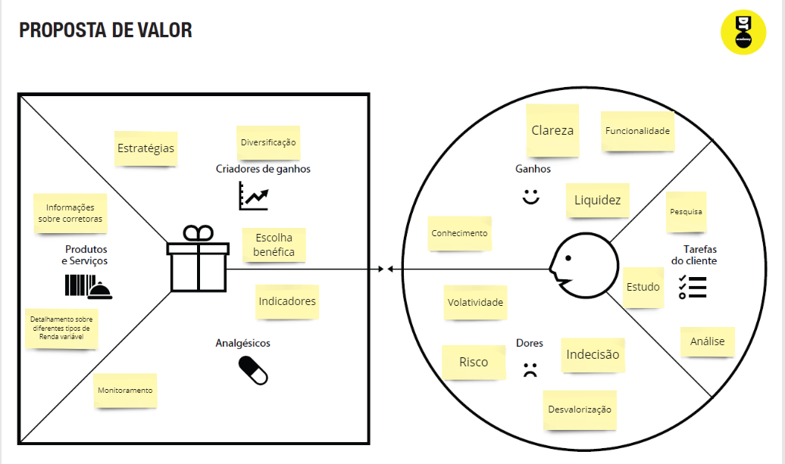
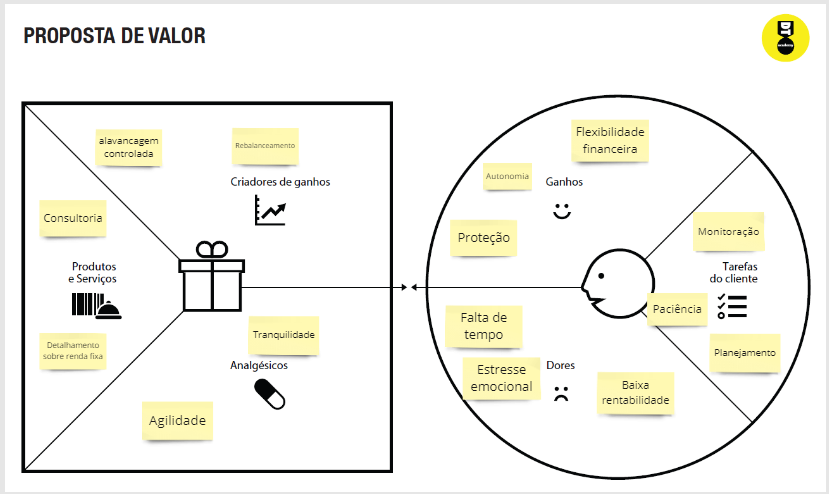
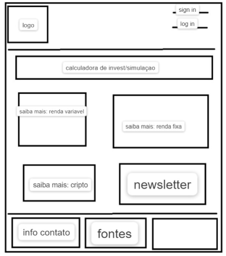
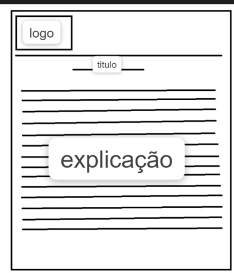

# Informações do Projeto
`TÍTULO DO PROJETO`  
InvestWiki

# InvestWiki

`CURSO` 
Ciência da Computação

## Participantes

> - Eduardo Martino Ferreira
> - Gustavo Bonissom
> - Hugo Foureaux Lopes
> - Marcos Paulo Laine
> - Pedro Augusto Silva

# Estrutura do Documento

- [Informações do Projeto](#informações-do-projeto)
  - [Participantes](#participantes)
- [Estrutura do Documento](#estrutura-do-documento)
- [Introdução](#introdução)
  - [Problema](#problema)
  - [Objetivos](#objetivos)
  - [Justificativa](#justificativa)
  - [Público-Alvo](#público-alvo)
- [Especificações do Projeto](#especificações-do-projeto)
  - [Personas, Empatia e Proposta de Valor](#personas-empatia-e-proposta-de-valor)
  - [Histórias de Usuários](#histórias-de-usuários)
  - [Requisitos](#requisitos)
    - [Requisitos Funcionais](#requisitos-funcionais)
    - [Requisitos não Funcionais](#requisitos-não-funcionais)
  - [Restrições](#restrições)
- [Projeto de Interface](#projeto-de-interface)
  - [User Flow](#user-flow)
  - [Wireframes](#wireframes)
- [Metodologia](#metodologia)
  - [Divisão de Papéis](#divisão-de-papéis)
  - [Ferramentas](#ferramentas)
  - [Controle de Versão](#controle-de-versão)
- [**############## SPRINT 1 ACABA AQUI #############**](#-sprint-1-acaba-aqui-)
- [Projeto da Solução](#projeto-da-solução)
  - [Tecnologias Utilizadas](#tecnologias-utilizadas)
  - [Arquitetura da solução](#arquitetura-da-solução)
- [Avaliação da Aplicação](#avaliação-da-aplicação)
  - [Plano de Testes](#plano-de-testes)
  - [Ferramentas de Testes (Opcional)](#ferramentas-de-testes-opcional)
  - [Registros de Testes](#registros-de-testes)
- [Referências](#referências)

# Introdução

## Problema

>Investir dinheiro é um desejo comum. No entanto, muitas pessoas se sentem inseguras e não têm o conhecimento necessário para começar. Os sites de investimento podem
>fornecer informações precisas e confiáveis sobre diferentes tipos de investimentos e estratégias. Com estes dados em mãos, os investidores podem minimizar os riscos e
>maximizar os retornos sem passar por uma longa e cansativa curva de aprendizado. Além disso, um site de investimento pode oferecer uma comunidade de investidores para
>compartilhar experiências e conhecimentos, tornando a jornada de investimento mais empolgante tanto para investidores iniciantes quanto para investidores experientes.

## Objetivos

>Um site sobre guia de investimentos tem como objetivos fornecer informações sobre investimentos, ajudar os investidores a tomar decisões informadas e orientar os
>leitores sobre estratégias de investimento. Além disso, o site pode oferecer ferramentas de análise e de acompanhamento de investimentos, notícias sobre o mercado
>financeiro e avaliações de risco.

## Justificativa

>O grupo pretende fornecer informações sobre os mais diversos tipos de investimentos que existem. Pretendemos também implementar ferramentas que auxilie o usuário
>nas tomadas de decisão acerca dos seus próprios investimentos

## Público-Alvo

> O público-alvo da InvestWiki são pessoas que pretendem começar a investir ou já investem, porém não têm muita experiência no assunto

# Especificações do Projeto

No site, pretendemos fornecer o maior número de informações possíveis sobre todos os tipos de investimentos, para isso, utilizaremos portais de notícias, por exemplo.
Para a interface, usaremos HTML, CSS e JavaScript, usaremos métodos de armazenamento em banco de dados, etc.

## Personas, Empatia e Proposta de Valor

> Pessoas diferentes com objetivos diferentes (1 a longo prazo e 1 a curto prazo)

## Histórias de Usuários

Com base na análise das personas forma identificadas as seguintes histórias de usuários:

|EU COMO... `PERSONA`| QUERO/PRECISO ... `FUNCIONALIDADE` |PARA ... `MOTIVO/VALOR`                 |
|--------------------|------------------------------------|----------------------------------------|
|Eduardo       |  preciso de segurança do dinheiro                | ter uma garantia de que posso investir sem perder todo o meu dinheiro |
|Marcelo       |  Quero saber quanto dinheiro estou fazendo       | facilitar a administração do tempo de cada investimento |
|Ana           | Quero poder investir em varias coisas diferentes | Não depender de uma unica fonte de renda  |
|Marcelo       |  Ver meus investimentos com clareza              | Saber sempre o estado do meu dinheiro nas ações |

## Requisitos

O escopo funcional do projeto é definido por meio dos requisitos funcionais que descrevem as possibilidades de interação  do usuario com a plataforma e os requisitos não funcionais que descrevem os aspectos que o sistema deverá apresentar de maneira geral.

### Requisitos Funcionais

|ID    | Descrição do Requisito  | Prioridade |
|------|-----------------------------------------|----|
|RF-001| Passar informações: Fornecer informações detalhadas sobre diferentes tipos de investimentos. | ALTA |
|RF-002| Calcular investimentos: Disponibilizar uma calculadora para realizar cálculos de investimentos. | ALTA |
|RF-003| Vender ebooks: Oferecer uma plataforma de comércio eletrônico para a venda de ebooks relacionados a finanças.  | BAIXA |

### Requisitos não Funcionais

|ID     | Descrição do Requisito  |Prioridade |
|-------|-------------------------|----|
|RNF-001| Veridicidade: Assegurar que todas as informações apresentadas no InvestWiki sejam verdadeiras e precisas. | ALTA | 
|RNF-002| Segurança: garantir que o site seja seguro e protegido contra ameaças externas. |  ALTA | 
|RNF-003| Desempenho: garantir que o site tenha um desempenho rápido e responsivo |  MÉDIA | 

## Restrições

O projeto está restrito pelos itens apresentados na tabela a seguir.

|ID| Restrição                                             |
|--|-------------------------------------------------------|
|01| O projeto deverá ser entregue até o final do semestre |
|02| Não pode ser desenvolvido um módulo de backend        |
|03| Não pode resolver o problema de só uma persona        |
|04| Precisa levar em conta as empresas terceiras          |
|05| Precisa ser constantemente atualizado para acompanhar o mercado    |
|06| precisa de um comprovante que valide a credibilidade do site    |

# Projeto de Interface

Pensamos em fazer uma interface simples e pratica para tentar não intimidar nossos usuarios

## Wireframes

# Home

É a pagina inicial do site, por ela os usuários podem acessar guias sobre as diversas formas de investir e  também a calculadora

# EXPLICAÇÃO

> exemplo de uma pagina de explicação

# Metodologia

Adotamos uma esatratégia em  cada um fazia partes separadas e que, ao final, completassem o site, tornando-o um site com o máximo possivel de informações e funcionalidades para o usuário.

## Ferramentas

| Ambiente  | Plataforma              |Link de Acesso |
|-----------|-------------------------|---------------|
|Processo de Design Thinkgin  | Miro | (https://miro.com/app/board/uXjVMYCYaSM=/) | 
|Repositório de código | GitHub | (https://github.com/ICEI-PUC-Minas-PPLCC-TI/ti-1-ppl-cc-m2-20231-guia-de-investimentos.git) | 
|Hospedagem do site |  |  replit.co (https://investwiki--pedroaugusto160.repl.co/TIAW/ti-1-ppl-cc-m2-20231-guia-de-investimentos/codigo/T.I.investCarroussel/T.I.investCarroussel/id.html) | 
|Protótipo Interativo | MIRO | (https://miro.com/app/board/uXjVM4gC44g=/) | 
|Editor de Código| VSCode | 

## Controle de Versão

> A ferramenta de controle de versão adotada no projeto foi o
> [Git](https://git-scm.com/), sendo que o [Github](https://github.com)
> foi utilizado para hospedagem do repositório `upstream`.
> 
> O projeto segue a seguinte convenção para o nome de branchs:
> 
> - `master`: versão estável já testada do software
> - `unstable`: versão já testada do software, porém instável
> - `testing`: versão em testes do software
> - `dev`: versão de desenvolvimento do software
> 
> Quanto à gerência de issues, o projeto adota a seguinte convenção para
> etiquetas:
> 
> - `bugfix`: uma funcionalidade encontra-se com problemas
> - `enhancement`: uma funcionalidade precisa ser melhorada
> - `feature`: uma nova funcionalidade precisa ser introduzida

# Projeto da Solução

Nosso objetivo no InvestWiki é capacitar investidores de
todos os níveis, fornecendo informações confiáveis e
recursos valiosos. Buscamos promover a educação
financeira e ajudar investidores a tomar decisões
informadas. 

## Tecnologias Utilizadas

Utilizamos o Figma e o Miro para fazermos o wireframe e o scrum do projeto, Replit para a hospedagem do site, Git e GitHub para controle de versão e hospedagem do repositório, Notion para a organização inicial do projeto, Visual Studio Code para o desenvolvimento do software, Discord, gGoogle meet e Microsoft Teams para reuniões com a equipe e os sites InfoMoney e XP Investimentos para garantir a veracidade das informações passadas ao usuário. 

# Referências
Utilizamos como referência os sites da XP investimentos e o site InfoMoney, que passam informações verídicas aos usuários, de maneira clara, didática e intuitiva.
