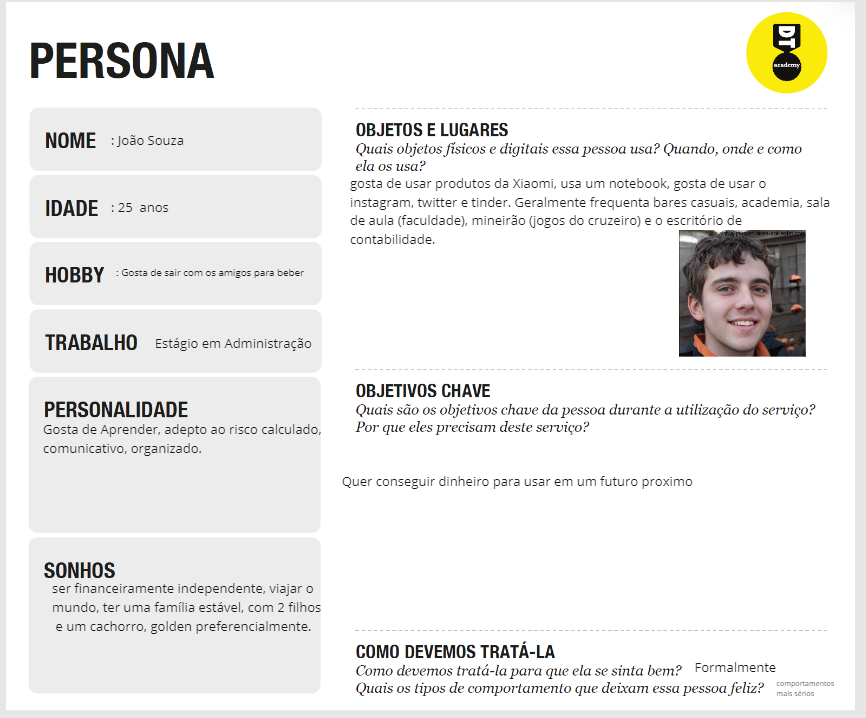

# Informações do Projeto
`TÍTULO DO PROJETO`  
InvestWiki

# InvestWiki

`CURSO` 
Ciência da Computação

## Participantes

> - Gustavo Bonisson e Silva
> - Marcos Paulo da Silva Laine
> - Hugo Foureaux Lopes
> - Pedro Augusto Silva Ferreira
> - Eduardo Martino Ferreira

# Estrutura do Documento

- [Informações do Projeto](#informações-do-projeto)
  - [Participantes](#participantes)
- [Estrutura do Documento](#estrutura-do-documento)
- [Introdução](#introdução)
  - [Problema](#problema)
  - [Objetivos](#objetivos)
  - [Justificativa](#justificativa)
  - [Público-Alvo](#público-alvo)
- [Especificações do Projeto](#especificações-do-projeto)
  - [Personas, Empatia e Proposta de Valor](#personas-empatia-e-proposta-de-valor)
  - [Histórias de Usuários](#histórias-de-usuários)
  - [Requisitos](#requisitos)
    - [Requisitos Funcionais](#requisitos-funcionais)
    - [Requisitos não Funcionais](#requisitos-não-funcionais)
  - [Restrições](#restrições)
- [Projeto de Interface](#projeto-de-interface)
  - [User Flow](#user-flow)
  - [Wireframes](#wireframes)
- [Metodologia](#metodologia)
  - [Divisão de Papéis](#divisão-de-papéis)
  - [Ferramentas](#ferramentas)
  - [Controle de Versão](#controle-de-versão)
- [**############## SPRINT 1 ACABA AQUI #############**](#-sprint-1-acaba-aqui-)
- [Projeto da Solução](#projeto-da-solução)
  - [Tecnologias Utilizadas](#tecnologias-utilizadas)
  - [Arquitetura da solução](#arquitetura-da-solução)
- [Avaliação da Aplicação](#avaliação-da-aplicação)
  - [Plano de Testes](#plano-de-testes)
  - [Ferramentas de Testes (Opcional)](#ferramentas-de-testes-opcional)
  - [Registros de Testes](#registros-de-testes)
- [Referências](#referências)

# Introdução

## Problema

>Investir dinheiro é um desejo comum. No entanto, muitas pessoas se sentem inseguras e não têm o conhecimento necessário para começar. Os sites de investimento podem
>fornecer informações precisas e confiáveis sobre diferentes tipos de investimentos e estratégias. Com estes dados em mãos, os investidores podem minimizar os riscos e
>maximizar os retornos sem passar por uma longa e cansativa curva de aprendizado. Além disso, um site de investimento pode oferecer uma comunidade de investidores para
>compartilhar experiências e conhecimentos, tornando a jornada de investimento mais empolgante tanto para investidores iniciantes quanto para investidores experientes.

## Objetivos

>Um site sobre guia de investimentos tem como objetivos fornecer informações sobre investimentos, ajudar os investidores a tomar decisões informadas e orientar os
>leitores sobre estratégias de investimento. Além disso, o site pode oferecer ferramentas de análise e de acompanhamento de investimentos, notícias sobre o mercado
>financeiro e avaliações de risco.

## Justificativa

>O grupo pretende fornecer informações sobre os mais diversos tipos de investimentos que existem. Pretendemos também implementar ferramentas que auxilie o usuário
>nas tomadas de decisão acerca dos seus próprios investimentos

## Público-Alvo

> O público-alvo da InvestWiki são pessoas que pretendem começar a investir ou já investem, porém não têm muita experiência no assunto

# Especificações do Projeto

No site, pretendemos fornecer o maior número de informações possíveis sobre todos os tipos de investimentos, para isso, utilizaremos portais de notícias, por exemplo.
Para a interface, usaremos HTML, CSS e JavaScript, usaremos métodos de armazenamento em banco de dados, etc.

## Personas, Empatia e Proposta de Valor

> Pessoas diferentes com objetivos diferentes (1 a longo prazo e 1 a curto prazo)

## Histórias de Usuários

Com base na análise das personas forma identificadas as seguintes histórias de usuários:

|EU COMO... `PERSONA`| QUERO/PRECISO ... `FUNCIONALIDADE` |PARA ... `MOTIVO/VALOR`                 |
|--------------------|------------------------------------|----------------------------------------|
|Eduardo       |  preciso de segurança do dinheiro                | ter uma garantia de que posso investir sem perder todo o meu dinheiro |
|Marcelo       |  Quero saber quanto dinheiro estou fazendo       | facilitar a administração do tempo de cada investimento |
|Ana           | Quero poder investir em varias coisas diferentes | Não depender de uma unica fonte de renda  |
|Marcelo       |  Ver meus investimentos com clareza              | Saber sempre o estado do meu dinheiro nas ações |

## Requisitos

O escopo funcional do projeto é definido por meio dos requisitos funcionais que descrevem as possibilidades de interação  do usuario com a plataforma e os requisitos não funcionais que descrevem os aspectos que o sistema deverá apresentar de maneira geral.

### Requisitos Funcionais

|ID    | Descrição do Requisito  | Prioridade |
|------|-----------------------------------------|----|
|RF-001| Gerenciamento de conta: permitir que os usuários gerenciem suas contas de investimento, incluindo depósitos, retiradas, transferências e histórico de transações. | ALTA |
|RF-002| Monitoramento de portfólio: fornecer aos usuários informações em tempo real sobre o desempenho de seus investimentos. | ALTA |
|RF-003| Pesquisa de investimentos: permitir que os usuários pesquisem e analisem diferentes tipos de investimentos disponíveis  | MEDIA |

### Requisitos não Funcionais

|ID     | Descrição do Requisito  |Prioridade |
|-------|-------------------------|----|
|RNF-001| O sistema deve ser responsivo para rodar em um dispositivos móvel | MÉDIA | 
|RNF-002| Segurança: garantir que o site seja seguro e protegido contra ameaças externas. |  ALTA | 
|RNF-003| Desempenho: garantir que o site tenha um desempenho rápido e responsivo |  BAIXA | 

## Restrições

O projeto está restrito pelos itens apresentados na tabela a seguir.

|ID| Restrição                                             |
|--|-------------------------------------------------------|
|01| O projeto deverá ser entregue até o final do semestre |
|02| Não pode ser desenvolvido um módulo de backend        |
|03| Não pode resolver o problema de só uma persona        |
|04| Precisa levar em conta as empresas terceiras          |
|05| Precisa ser constantemente atualizado para acompanhar o mercado    |
|06| precisa de um comprovante que valide a credibilidade do site    |

# Projeto de Interface

Pensamos em fazer uma interface simples e pratica para tentar não intimidar nossos usuarios

## User Flow
 
> 

## Wireframes

# Home

É a pagina inicial do site, por ela os usuários podem acessar guias sobre as diversas formas de investir e  também a calculadora

# Sign in

Caso o usuario não possua uma conta e pretenda criar uma, ele sera movido para a pagina de sign in na qual ele podera criar sua conta no site

# LOGIN

> Caso o usuario ja tenha uma conta cadastrada so site, ele sera levada para uma tela de login na qual usara seu usuario e senha para acessar as funções do site.

# EXPLICAÇÃO

> exemplo de uma pagina de explicação

# Metodologia

O grupo adotou o Design Thinking e o Framework Scrum como metodologias de trabalho tendo inicialmente produzido uma serie de perguntas usadas para entrevistar pessoas que posteriormente seriam usadas de base na criação das personas, além do mapa de design thinking produzido no aplicativo MIRO. Após a criação das personas, entramos em processo de branstorm  para assim chegar-mos na conclusão de como abordar a maioria de seus problemas de forma criativa e eficiente.

## Divisão de Papéis

Esta imagem NÃO corresponde ao presente (falta tarefas a serem designadas)

## Ferramentas

......  COLOQUE AQUI O SEU TEXTO - SIGA O EXEMPLO DA TABELA ABAIXO  ......

| Ambiente  | Plataforma              |Link de Acesso |
|-----------|-------------------------|---------------|
|Processo de Design Thinkgin  | Miro | (https://miro.com/app/board/uXjVMYCYaSM=/) | 
|Repositório de código | GitHub | (https://github.com/ICEI-PUC-Minas-PPLCC-TI/ti-1-ppl-cc-m2-20231-guia-de-investimentos.git) | 
|Hospedagem do site |  |  Nenhuma (por enquanto) | 
|Protótipo Interativo | MavelApp ou Figma | (https://www.figma.com/file/rOQONeternLae5GZsw97gh/Untitled?t=IPeI9PSn8iJUpGhh-1) | 
|Editor de Código| VSCode | Nenhum (por enquanto) | | 
|Divisão de Tarefas| Bitrix24 | https://b24-6r27id.bitrix24.com.br/?secret=3b7dv5yz| 

## Controle de Versão

> A ferramenta de controle de versão adotada no projeto foi o
> [Git](https://git-scm.com/), sendo que o [Github](https://github.com)
> foi utilizado para hospedagem do repositório `upstream`.
> 
> O projeto segue a seguinte convenção para o nome de branchs:
> 
> - `master`: versão estável já testada do software
> - `unstable`: versão já testada do software, porém instável
> - `testing`: versão em testes do software
> - `dev`: versão de desenvolvimento do software
> 
> Quanto à gerência de issues, o projeto adota a seguinte convenção para
> etiquetas:
> 
> - `bugfix`: uma funcionalidade encontra-se com problemas
> - `enhancement`: uma funcionalidade precisa ser melhorada
> - `feature`: uma nova funcionalidade precisa ser introduzida

# **############## SPRINT 1 ACABA AQUI #############**

# Projeto da Solução

......  COLOQUE AQUI O SEU TEXTO ......

## Tecnologias Utilizadas

......  COLOQUE AQUI O SEU TEXTO ......

> Descreva aqui qual(is) tecnologias você vai usar para resolver o seu
> problema, ou seja, implementar a sua solução. Liste todas as
> tecnologias envolvidas, linguagens a serem utilizadas, serviços web,
> frameworks, bibliotecas, IDEs de desenvolvimento, e ferramentas.
> Apresente também uma figura explicando como as tecnologias estão
> relacionadas ou como uma interação do usuário com o sistema vai ser
> conduzida, por onde ela passa até retornar uma resposta ao usuário.
> 
> Inclua os diagramas de User Flow, esboços criados pelo grupo
> (stoyboards), além dos protótipos de telas (wireframes). Descreva cada
> item textualmente comentando e complementando o que está apresentado
> nas imagens.

## Arquitetura da solução

......  COLOQUE AQUI O SEU TEXTO E O DIAGRAMA DE ARQUITETURA .......

> Inclua um diagrama da solução e descreva os módulos e as tecnologias
> que fazem parte da solução. Discorra sobre o diagrama.
> 
> **Exemplo do diagrama de Arquitetura**:
> 
> 

# Avaliação da Aplicação

......  COLOQUE AQUI O SEU TEXTO ......

> Apresente os cenários de testes utilizados na realização dos testes da
> sua aplicação. Escolha cenários de testes que demonstrem os requisitos
> sendo satisfeitos.

## Plano de Testes

......  COLOQUE AQUI O SEU TEXTO ......

> Enumere quais cenários de testes foram selecionados para teste. Neste
> tópico o grupo deve detalhar quais funcionalidades avaliadas, o grupo
> de usuários que foi escolhido para participar do teste e as
> ferramentas utilizadas.
> 
> **Links Úteis**:
> - [IBM - Criação e Geração de Planos de Teste](https://www.ibm.com/developerworks/br/local/rational/criacao_geracao_planos_testes_software/index.html)
> - [Práticas e Técnicas de Testes Ágeis](http://assiste.serpro.gov.br/serproagil/Apresenta/slides.pdf)
> -  [Teste de Software: Conceitos e tipos de testes](https://blog.onedaytesting.com.br/teste-de-software/)

## Ferramentas de Testes (Opcional)

......  COLOQUE AQUI O SEU TEXTO ......

> Comente sobre as ferramentas de testes utilizadas.
> 
> **Links Úteis**:
> - [Ferramentas de Test para Java Script](https://geekflare.com/javascript-unit-testing/)
> - [UX Tools](https://uxdesign.cc/ux-user-research-and-user-testing-tools-2d339d379dc7)

## Registros de Testes

......  COLOQUE AQUI O SEU TEXTO ......

> Discorra sobre os resultados do teste. Ressaltando pontos fortes e
> fracos identificados na solução. Comente como o grupo pretende atacar
> esses pontos nas próximas iterações. Apresente as falhas detectadas e
> as melhorias geradas a partir dos resultados obtidos nos testes.

# Referências

......  COLOQUE AQUI O SEU TEXTO ......

> Inclua todas as referências (livros, artigos, sites, etc) utilizados
> no desenvolvimento do trabalho.
> 
> **Links Úteis**:
> - [Formato ABNT](https://www.normastecnicas.com/abnt/trabalhos-academicos/referencias/)
> - [Referências Bibliográficas da ABNT](https://comunidade.rockcontent.com/referencia-bibliografica-abnt/)
